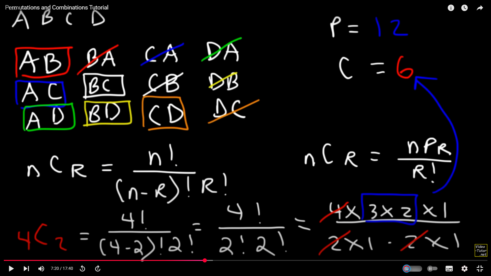

Permutations

Combinations

Conditional probability:
What is conditional probability and example https://www.youtube.com/watch?v=dQ6RL8qe320

Dependent and Independent Events 
https://www.youtube.com/watch?v=lWAdPyvm400

Bayes Theorem
https://www.youtube.com/watch?v=OByl4RJxnKA 
https://www.youtube.com/watch?v=akClB1J6b28 ===> Best explaination of bayes theorem  
-> Exp of bayes theorem

discrete and Continuous Random Variables:  https://www.youtube.com/watch?v=dOr0NKyD31Q

bernoulli, 

binomial, 

poisson